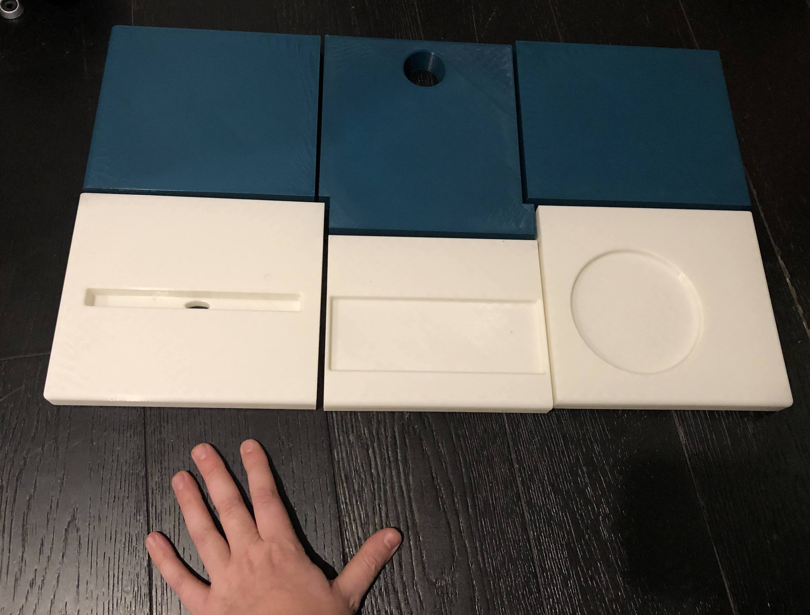
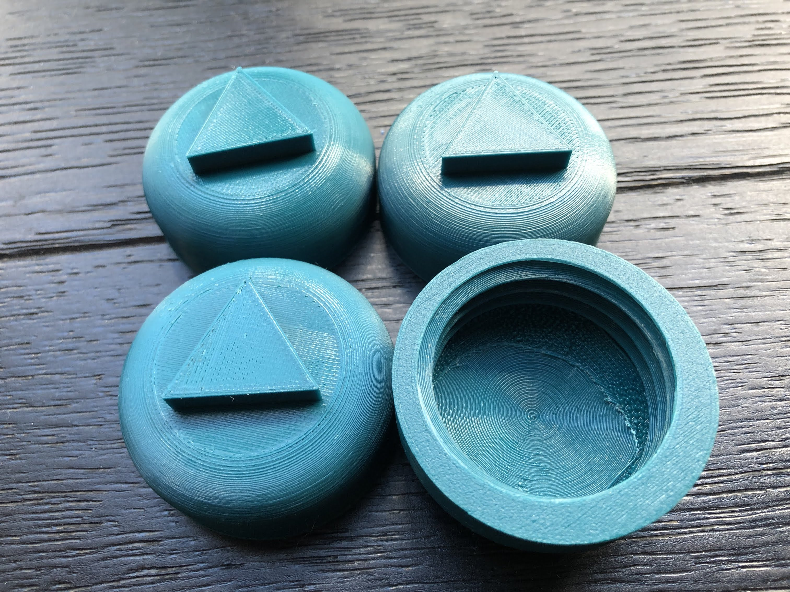
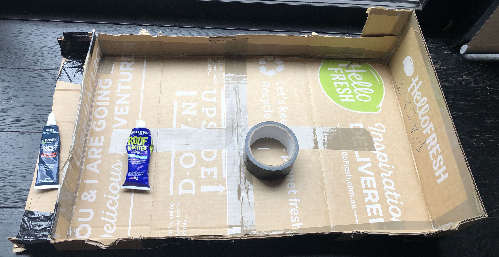
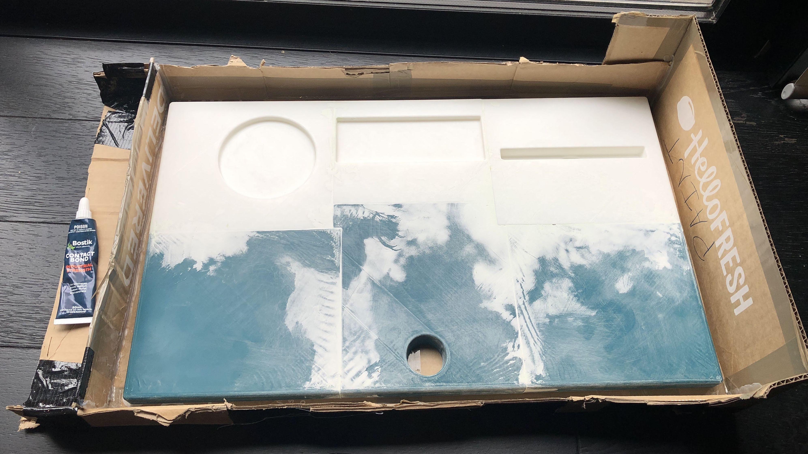
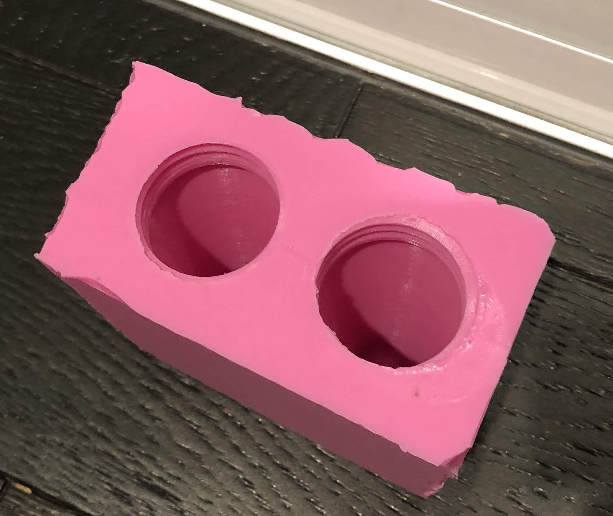
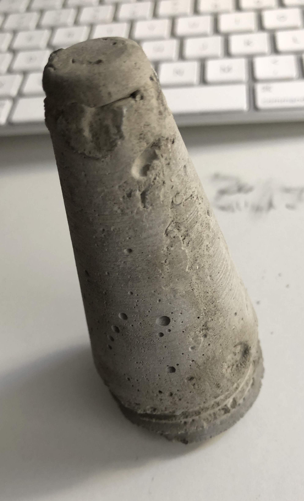

# Table riser

- [x] unexpected issues:
  - [x] bed heating wire stress break
    - soldered
  - [ ] foam latex better than pinkysil for desk
    - buy foam latex
    - buy cheap expanding foam insulation
  - [ ] leg insert cement fills gaps poorly
    - double-cast, one rough, one epoxy
  - [x] too heavy
    - styrofoam inset
  - [ ] not structurally sound
    - buy & insert cheap metal netting

- [x] Describe
	- Sealed cement top slab
	- Giant screw thread legs, bottom out flat, material unknown
	- 3degree insert chamfer with finger grab cutback 
	- Plastic leg screw inserts smol twist

- [x] Design
	- [x] desk surface
		- [x] cut into printable segments
	- [x] plastic leg screw insert
	- [x] redesign to remove flaws
	- [x] plastic/cement legs
	- [ ] redesign to remove flaws

- [x] Print
	- [x] desktop
		- [x] back left
		- [x] back mid
		- [x] back right
		- [x] front left
		- [x] front mid
		- [x] front right
      
	- [x] leg insert
		- [x] 2
		- [x] 3
		- [x] 4
      
	- [x] leg
		- [x] 2

- [x] Cleanup
	- [x] clear flashing
	- [x] rough sand sides

- [x] Assemble
	- [x] superglue desk pieces

- [ ] Mold
	- [ ] desk
		- [ ] coat assembled desk in oil
		- [x] create cheap cardboard mold box
    - [x] silicone seams
      
    - [ ] foam latex thin layer
    - [ ] cheap foam latex filler/form/construction
      
	- [x] leg?
		- [x] lego outside mold parts
		- [x] cast pinkysil
      

- [ ] Casting
	- [ ] desk
		- [ ] insert leg insert 1-4
		- [ ] cast cement positive
	- [x] legs
		- [x] test cast
      
    - [ ] cast
			- [ ] 2
			- [ ] 3
			- [ ] 4

- [ ] Finish
	- [ ] desk
		- [ ] buff desk cement
		- [ ] apply cement sealer to desk
	- [ ] leg
		- [ ] buff legs
		- [ ] apply cement sealer to legs

- [ ] Photograph

- [ ] Thingiverse
